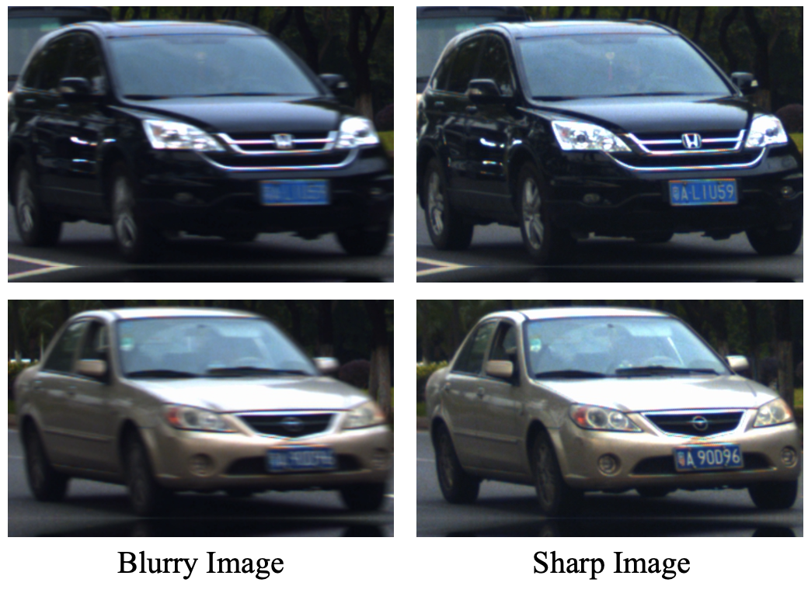

# ROMB: Real Object Motion Blur


## Introduction

The ROMB dataset contains naturally blurry and sharp image pairs with fast-moving objects (car only for the time being). It aims to serve as a better benchmark dataset for image motion deblurring in real scene. In general, the ROMB dataset contains 13452 pairs of cars, captured in 16 scenarios. For the purpose of evaluation, we randomly select 10 scenarios as the training set and the rest 6 scenarios as the test set, resulting in 8533 pairs of training images and 4919 pairs of test images. 

To construct this dataset, we introduce an easy-to-set-up dual-camera capturing system, and a data cleaning method using PSNR metric and the sliding window technique. For more details, please refer to our technique report: [Edge Prior Augmented Networks for Motion Deblurring on Naturally Blurry Images](https://github.com/jay19950/ROMB_dataset).


## How to download

The ROMB dataset can be downloaded at [Google Drive](https://github.com/jay19950/ROMB_dataset).

Since ROMB contains sensitive contents, *e.g.*, license plate number, we have encrypted the dataset files. To obtain the decrypt password, you are required to fill out an agreement to the [ROMB Terms of Use](https://github.com/jay19950/ROMB_dataset/ROMB_TOS.pdf), and send it to us at [Email Address].

If you have not received a response within a week, it is likely that your email is bouncing - please check this before sending repeat requests.

Please check the [changelog](https://github.com/jay19950/ROMB_dataset#changelog) for updates to the data release.

if you use the ROMB dataset, please cite

```
@article{chen2021edge,
  title={Edge Prior Augmented Networks for Motion Deblurring on Naturally Blurry Images},
  author={Chen, Yuedong and Huang, Junjia and Wang, Jianfeng and Xie, Xiaohua},
  journal={arXiv preprint arXiv:},
  year={2021}
}
```


## Data organization

[TODO: Give some more information of dataset files here]

Two samples of ROMB are give as below,



## Changelog

* 14 Sept. 2021, release the ROMB dataset version 1.0
